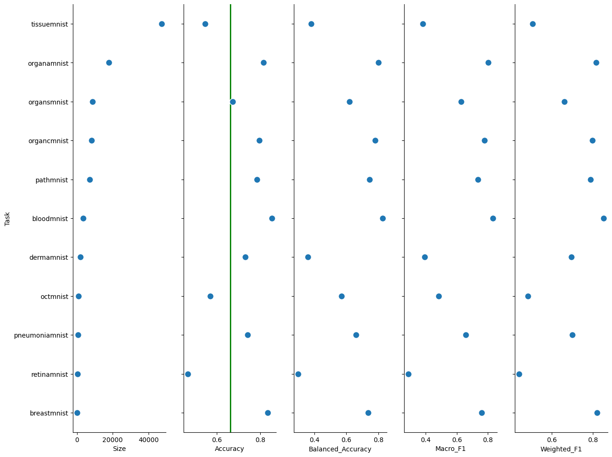
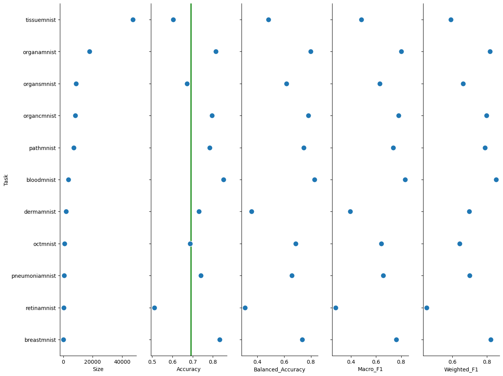

# Multi-Task MedMNIST

This project is developed in accordance with the Community Prediction Competition hosted on Kaggle: Tensor Reloaded: Multi-Task MedMNIST (link: https://www.kaggle.com/competitions/tensor-reloaded-multi-task-med-mnist).

The competition is organized by Tensor Reloaded, a research group within the Faculty of Computer Science at Alexandru Ioan Cuza University, Iasi, Romania.

## NON-TECHNICAL EXPLANATION OF YOUR PROJECT
According to the information provided on the Kaggle competition page, "this competition is designed to foster advancements in biomedical image analysis through machine learning." Participants are required to develop models capable of classifying multiple medical image datasets, covering images such as X-rays, CT scans, and pathology slides.

## DATA
The competition utilizes a collection of pre-processed 2D biomedical datasets, with images resized to 28x28 pixels (although other sizes are available, this project focuses on the preferred 28x28 resolution).

Datasets:
- PathMNIST: Colon pathology images (9 classes) - 89.996 images in training set - RGB
- DermaMNIST: Dermatoscope images (7 classes) - 7.007 images in training set - RGB
- OCTMNIST: Retinal OCT images (4 classes) - 97.477 images in training set - grayscale
- PneumoniaMNIST: Chest X-rays for pneumonia detection (2 classes) - 4.708 images in training set - grayscale
- RetinaMNIST: Fundus camera images (ordinal regression, 5 classes) - 1.080 images in training set - RGB
- BreastMNIST: Breast ultrasound images (2 classes) - 546 images in training set - grayscale
- BloodMNIST: Blood cell microscope images (8 classes) - 11.959 images in training set - RGB
- TissueMNIST: Kidney cortex microscope images (8 classes) - 165.466 images in training set - grayscale
- OrganAMNIST: Abdominal CT images (11 classes) - 34.581 images in training set - grayscale
- OrganCMNIST: Abdominal CT images (11 classes) - 13.000 images in training set - grayscale
- OrganSMNIST: Abdominal CT images (11 classes) - 13.940 images in training set - grayscale

All images are resized to 32x32 pixels, and grayscale images are converted to RGB format by adding additional channels to ensure uniform processing.

## MODEL 
The solution leverages a pretrained VGG16 model. The main convolutional layers of the model are frozen and not trainable. The top layers consist of Dense and Dropout layers, optimized for performance.

## HYPERPARAMETER OPTIMSATION
Hyperparameter optimization is conducted using Bayesian Optimization on subsamples of the training set:
    - 30% of the training set if the dataset contains more than 80,000 images.
    - 40% of the training set if the dataset contains 10,000 to 80,000 images.
    - 50% of the training set for smaller datasets

Optimized parameters:
    - dense_units in the top layers: [256, 512, 1024]
    - dropout_rate: min=0.2, max=0.5
    - optimizer: [adam, rmsprop, sgd]
    - learning_rate: min=1e-4, max=1e-2 (logarithmic sampling)

Each trial consists of 3 training epochs, evaluating the weighted F1-score on validation data. To reduce preparation time, the number of trials depends on the dataset size:
    - 20 trials for datasets with fewer than 10,000 images (batch size: 32)
    - 10 trials for larger datasets (batch size: 64 or 128 for TissueMNIST)

## RESULTS
A study by Jiancheng Yang et al. (2023), "MedMNIST v2 - A large-scale lightweight benchmark for 2D and 3D biomedical image classification" (also: https://medmnist.com/), presents solutions based on ResNet18/ResNet50. This project explores the effectiveness of VGG16, optimizing it separately for each dataset using the weighted F1-score as the objective metric.

The models achieved an average accuracy of 0.662, but performance was affected by TissueMNIST, the largest dataset. The lowest-performing datasets were:
    - RetinaMNIST: 0.468 (compared to 0.531 in the published study)
    - TissueMNIST: 0.547 (compared to 0.703)
    - OCTMNIST: 0.571 (compared to 0.776)

The best-performing models were:
    - BloodMNIST: 0.853 (compared to 0.966)
    - BreastMNIST: 0.833 (compared to 0.863)
    - OrganAMNIST: 0.816 (compared to 0.951)

No clear correlation was found between model performance and dataset characteristics such as training set size or color format (RGB vs. grayscale). Detailed results are presented in the chart below.

The lowest-performing tasks was improved by unfreezing 6 last layers. Additionally, RetinaMNIST were trained with 16 batch size.
As the result of that, overall accuracy increased to 0.692. The lowest-performing datasets obtained:
    - RetinaMNIST: 0.515
    - TissueMNIST: 0.604
    - OCTMNIST: 0.688

## (OPTIONAL: CONTACT DETAILS)
If you are planning on making your github repo public you may wish to include some contact information such as a link to your twitter or an email address. 